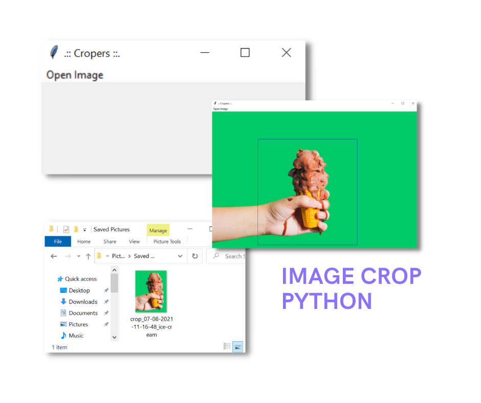

# Image Crop Python

Image Crop application built using Python with 
Pillow library which is lightweight and easy to use.



## Quick Start

clone this project, then go to the 
project directory and run the following command:

```bash
pip install -r requirements.txt
python main.py
```

> Recommended using a virtual environment!

